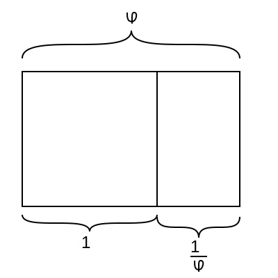
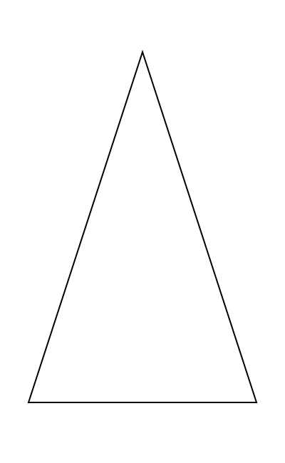
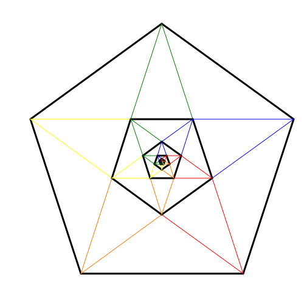

## [back to meme factory](../)

# What is the Golden Ratio?

This is self-replicating media based on the Golden Ratio.  

$$
\phi \equiv \frac{1 + \sqrt{5}}{2} \approx 1.618
$$

A Golden Rectangle has the property that the rectangle left over when you section off a square from it is also a Golden Rectangle.  From this the following diagram can be drawn to see how a self-similar rectangle inside a rectangle leaves a square, and what that implies about the Golden Ratio $\phi$.  Notice that the long side with length $\phi$ is the sum of the unit side of the square and the reciprocal of the Golden Ratio $1/\phi$.  Writing this in algebra, we get

$$
\phi = 1 + \frac{1}{\phi}.
$$

This can be rearranged to make it more familiar from high school algebra to be 

$$
\phi^2 = \phi + 1
$$

or putting it in the form of the quadratic equation 

$$
ax^2 + bx + c = 0
$$

we get

$$
\phi^2 - \phi - 1 = 0, 
$$

from which we get a = 1, b = -1 and c = -1 in the equation 

$$
\phi = \frac{-b \pm \sqrt{b^2 - 4ac}}{2a} = \frac{1 \pm \sqrt{1 + 4}}{2}.
$$

And note that since $\sqrt{5} > 1$ that only the positive root has a positive value that makes sense, so we get the definition of $\phi$ as

$$
\phi = \frac{1 + \sqrt{5}}{2}.
$$

What good is this? From the Golden Ratio we can build the Golden Triangle, which is the isosceles triangle defined by the Golden Ratio, shown here:

And from this, we can construct all of the geometry of fivefold symmetry! This can be used to build the pentagon, the pentagram, and all the complex sub-structures that can be embedded in them, shown here:

Many other types of geometry based on fivefold symmetry show Golden Ratio based geometry, including [Penrose Tiles](https://en.wikipedia.org/wiki/Penrose_tiling), [Islamic Tiling](https://en.wikipedia.org/wiki/Girih), and [quasicrystals](https://en.wikipedia.org/wiki/Quasicrystal).  Various dubious examples of the Golden Ratio are cited in numerous popular works, usually with a very rough overlay of geometry on images.  

What we do here in this software is play with this, taking images of objects in a given place, uploading them to this page, overlaying the most typical Golden Ratio based symbols on them to see how this geometry does or does not appear in the world directly around us.

[editor.php](editor.php)
